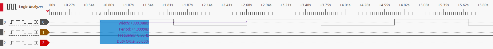
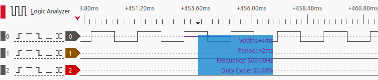
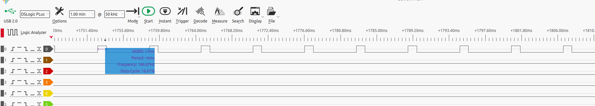
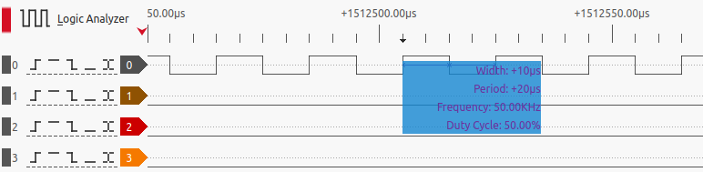

# Gpio manager

This module implements a platform device driver to manage devices that each
take ownership of a GPIO line. The device in this case is simply a means
for the driver to take control of one or more gpio lines.

The driver is controllable through a sysfs interface.

NOTE:
This is meant as a basic reference/example kernel module using the GPIO consumer
API. There are otherwise of course better options for the purpose, both in terms
of the hardware and software:
 - linux offers various ready-made kernel drivers for common gpio consumer use
   cases. See for example drivers/leds/leds-gpio.c
 - many SoCs GPIO pins have built-in functions (e.g. pwm) that are much more
   effficient than software emulation.


### Building the module

Change the `KERNEL_SRC` variable indicated in the `Makefile`, then simply run
`make` to build the module for use with the low-resolution kernel timer API
or `make USE_HR_TIMERS=y` to build the module for use with the high-res API.

## Device tree, devices, and GPIO line assignment

With the new gpio descriptor - based API, GPIO lines must be *assigned* to
devices. Devices cannot simply claim control of a GPIO line without having been
assigned the line first. Assignment can happen in a board file, device tree etc.

It is assumed a device tree is used. This module was written for and tested on
a rasperry Pi 4B running ubuntu 22. The following is taken from one such test.

### Device tree overlay

Recent kernel version allow patching the device tree via overlays at runtime,
without a need for restarting the system. It is assumed that the kernel was
build with support for configs and device trees and device tree overlays and
that the configs is mounted.
```
user@system:/$ cat /boot/config-$(uname -r) | grep -e -i -e 'CONFIG_OF_OVERLAY' -e 'CONFIG_OF_CONFIG' -e 'CONFIGFS_FS'
CONFIG_OF_OVERLAY=y
CONFIG_OF_CONFIGFS=y
CONFIG_CONFIGFS_FS=y

user@system:/$ mount | grep -i config
configfs on /sys/kernel/config type configfs (rw,nosuid,nodev,noexec,relatime)
```

The following is an example of a device tree overly for use with this module.
```
/dts-v1/;
/plugin/;  /* overlay spec file */

{
   fragment@0 {
      target-path="/";  /* child of root */

      __overlay__ {
         virtual_gpiomanager {
            compatible="vcstech,virtual_gpioman_device";
            custom-gpios = <&gpio 21 0>;
         };
      };
   };
};
```
NOTE:
 * the overlay created a new device under the root of the device tree for the
   system. This is necessary so that the device gets implicitly
   created/instantiated by the kernel as a platform device.
 * Once instantiated, the device will match this kernel driver based on its
   `compatible` (which must be as shown) DT property and/or the name
   ("virtual-gpiomanager") and will be bound to the driver.
 * the driver expects one device per gpio line/pin. Put differently, to take
   control of n GPIO pins, create n entries like the one above, all of them
   directly under the root node of the DT.

Here's an example of a DT overlay with two separate device entries:
```
/dts-v1/;
/plugin/;  /* overlay spec file */

/{
   fragment@0 {
      target-path="/";  /* child of root */

      __overlay__ {
         virtual_gpiomanager0 {
            compatible="vcstech,virtual_gpioman_device";
            custom-gpios = <&gpio 21 0>;
         };
         virtual_gpiomanager1 {
            compatible="vcstech,virtual_gpioman_device";
            custom-gpios = <&gpio 20 0>;
         };

      };
   };
};
```

The device tree overlay can be applied as follows (it is assumed the overlay
above is stored in a file named `gpioman.dto`):
```
# create sysfs directory for the overlay; NOTE: directory name is arbitrary
sudo mkdir /sys/kernel/config/device-tree/overlays/gpioman

# compile the device tree overlay spec; NOTE: it is assumed the device tree
# compiler (dtc) is installed on the target system.
dtc -I dts -O dtb -o gpioman.dtbo gpioman.dto

# load the compilled DT overlay blob
cat gpioman.dtbo | sudo tee /sys/kernel/config/device-tree/overlays/gpioman/dtbo
```
Check `dmesg -w` output for errors. No message means the overlay was applied ok.


## loading the kernel driver

The driver may be packaged in a more proper way but the easiest thing to do for
the sake of a quick demo is to build the kmod out of tree (as provided) and
copy the `.ko` artifact onto the target system, then load it with `insmod`.
```
sudo insmod ./gpioman.ko
```

There should be messages along the following lines in the kernel log buffer:
```
# dmesg -w
[ 1979.888989] gpioman: module loaded
[ 1979.889248] gpioman: Bound to device: 'virtual_gpiomanager'
```

The device (practically, the GPIO line assigned to it, which is what we are
interested in) is now controllable via sysfs.

## sysfs interface

The driver will create a sysfs entry for itself under `/sys/kernel`.
Files in `/sys/kernel/` represent attributes applying to the module as a whole,
globally. Directories under `/sys/kernel` represent devices bound to the driver.
One directory is created for each device. Each device directory contains a
number of files, automatically created, which make it possible to control the
GPIO line assigned to the device.
```
user@system:/sys/kernel/gpioman-driver/virtual_gpiomanager$ ls -l
total 0
-rw-rw-r-- 1 root root 4096 Nov 23 16:27 freq
-rw-rw-r-- 1 root root 4096 Nov 23 16:27 off_cycles
-rw-rw-r-- 1 root root 4096 Nov 23 16:27 on_cycles
-rw-rw-r-- 1 root root 4096 Nov 23 16:27 status
```

A description of each file/attribute follows:
 - `freq`: the number of cycles (number of times the GPIO line will be asserted)
    per second. NOTE that if the module was compiled in low-res mode, any
    freq value > HZ, where HZ is the compile-time constant for the kernel (see
    the comment in the source file) is ignored and the frequency is set to HZ
    instead. This is because this is the best possible resolution: you can't
    get a better resolution than a `jiffy`.
 - `status`: this is a binary value. `0` means the line is set to logic
    low and no pulses are generated. `1` means the line is asserted (set to
    logic high) and pulses are generated based on the values of `freq`,
    `off_cycles` and `on_cycles`, as described in a subsequent section.
 - `on_cycles` is the number of contiguous cycles that the line stays asserted.
    Essentially, each cycle is a pulse with 100% duty cycle.
 - `off_cycles` is the number of contigous cycles that the line stays low.
    Essentially, each cycle is a pulse with 0% duty cycle.

NOTE: The values must not be negative and are expected to be sensible. E.g.
a resolution of 1us is not normally achievable especially on e.g. a busy
raspberry PI.


## pulse generation

If `status` is `0`, then all other variables are out of play: the line is set low
until `status` is set to `1`. This is the default.

When `status` is set to `1`, pulses are generated in a way that depends on all
the other variables. Every second is divided into HZ time slots, where each
time slot corresponds to a pulse with either 100% (an `on_cycle`) or 0%
(an `off_cycle`) duty cycle.
Whether a given pulse is an `on_cycle` or an `off_cycle` depends on the values
of `on_cycles` and `off_cycles`. In essence, the line is asserted for a period
of `on_cycles`, then set low for a period of `off_cycles`, in an infinite loop
(until the user sets `status` to `0` or the module is unloaded etc).

Notice that therefore `on_cycles` and `off_cycles` combine to form a composite
pulse (the follwing assume `freq` > 0):
 - if `on_cycles` is 0 and `off_cycles` is non-zero, the line is always low
   (just as if `status` were 0 but much more wasteful of cpu time since
   timers are scheduled for each time slot).

 - if `on_cycles` is non-zero and `off_cycles` is zero, the line is always high
   (just as if `freq` were 0 and `status` were 1 -- but again, much more
   wasteful of CPU time)

 - if `on_cycles` and `off_cycles` are both 1, the practical result is a square
   wave (50% duty cycle pulse) where the pulse width is 1 time slot (1/`freq`)
   (and the pulse is therefore off for the following time slot).
   Of course, if `on_cycles` and `off_cycles` are both x, this represents the
   same ratio -- i.e. also a 50% duty cycle pulse (square wave). But the period
   of the wave is different: the pulse is now on for `on_cycles` and off for
   `off_cycles`. The period of this composite pulse is therefore always given
   by `on_cycles` + `off_cycles` (where each cycle's period is 1/`freq`) and
   the pulse width is given by the duration of `on_cycles`.

   NOTE that of course, `on_cycles` and `off_cycles` may well be different. For
   example, if `on_cycles`=3 and `off_cycles`=1, this gives a pulse with 75%
   duty cycle.

   NOTE this can easily be used to dim an LED. For this, you want the frequency
   to be high, and the `on_cycles` to be lower than `off_cycles`, while keeping
   `on_cycles` and `off_cycles` as small as possible (obviously, `on_cycles=200,
   off_cycles=800` will not have the same effect as `on_cycles=2, off_cycles=8`
   for reasons already discussed: the period of the composite pulse is much
   longer in the former case, and the duration for which the pulse is on vs off
   is much more noticeable to the eye, resulting in blinking rather than dimming).

### Logic analyzer trace

Finally, below are some demonstrative screenshots of logic analyzer traces
(measured on a RPI4b running ubuntu 22, as mentioned).

freq=1, on_cycles=1, off_cycles=1  ==> square wave


freq=1KHz, on_cycles=1, off_cycles=1 ==> square wave, much higher frequency


freq=1KHz, on_cycles=1, off_cycles=5  ==> duty cycle 1/6



### Low-res vs High-res timers

In my findings, the low resolution timers seem quite inaccurate, even when the
frequency is below the kernel HZ. The pi4b was struggling to accurately
set up timers for a frequency of 100Hz. Conversely, the logic analyzer traces
show the high-res timers to be highly accurate, even at relatively much higher
frequencies (see below screenshot of 50KHz square wave measurement; here
sysfs freq=100KHz -- 100K 'time slots' make up each second, as discussed
earlier. The time slots alternate between a 100% duty-cycle pulse and
a 0% duty-cycle pulse, the result being a composite square wave with 50% duty
cycle at half the frequency of the `freq` vaue set in `sysfs`).

freq=100KHz, on_cycles=1, off_cycles=1  ==> square wave


Part of the reason for the relative inaccuracy of the low-res timers stems from
the jiffy approximations and conversions. For instance, on this example system
HZ=250; setting up the driver with `freq`=100 will give a resolution not of 10 ms,
but of 3 jiffies, which is app 12 ms since:
```
jiffy = 1/HZ = 4 ms => 3 jiffies = 12 ms).
```
In practice, however, it seems worse. The logic analyzer trace shows periods
of app 16 ms, which is a long way off from the 10ms resolution you may expect
(and which the hr timers have no trouble providing).


